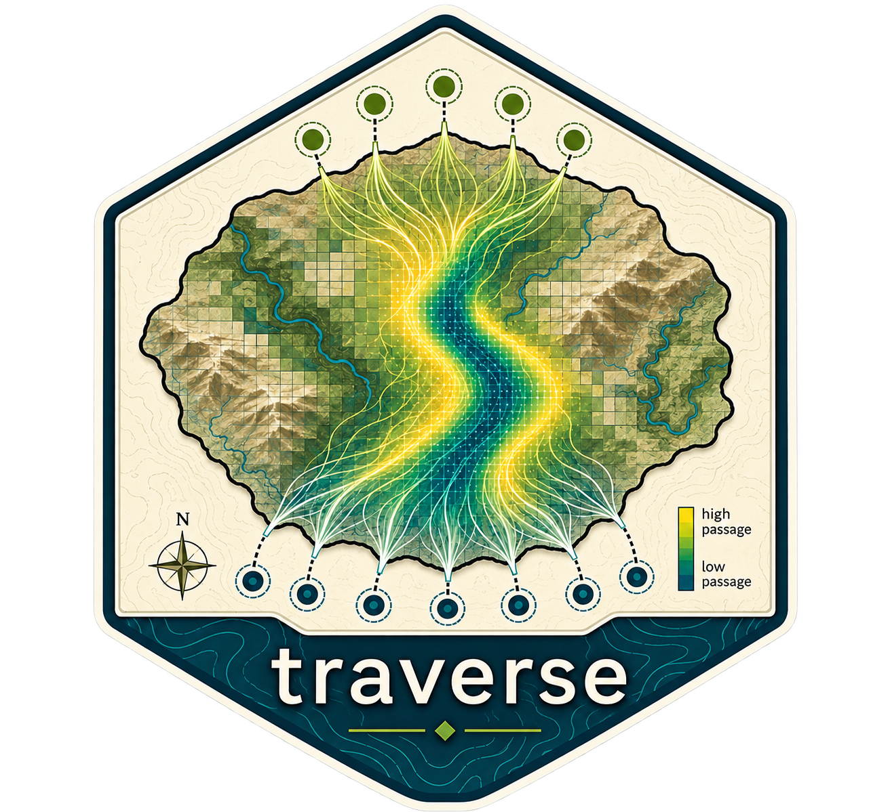

<p align="center">
  
</p>
  

# traverse

`traverse` estimates spatial passage across gridded landscapes between user-defined source and destination sets. It separates the scientific target domain from a buffered computational domain, allowing terminal nodes to be placed outside the area of interpretation and removed cleanly from final outputs.

The package uses `terra::SpatRaster` and `terra::SpatVector` in its user-facing API. It currently uses `gdistance` as an internal randomized-shortest-path backend; legacy `raster`, `sp`, and `gdistance` classes are not required as user inputs.

## Core workflow

```r
library(traverse)

template <- terra::rast(
  nrows = 20, ncols = 30, xmin = 0, xmax = 30, ymin = 0, ymax = 20,
  crs = "EPSG:3857"
)
terra::values(template) <- 1
template[10, 15] <- NA # an excluded cell remains a hole in the target mask

domain <- traverse_domain(template, buffer = 5, buffer_units = "cells")
surface <- traverse_surface(
  template, domain = domain, type = "conductance", outside_value = 1
)
sources <- traverse_nodes(domain, side = "south", distance = 1, n = 8)
targets <- traverse_nodes(domain, side = "north", distance = 1, n = 8)

result <- traverse(
  surface, domain, sources = sources, targets = targets,
  directions = 16, theta = 1, correction = "c", aggregation = "mean"
)

plot(result)                         # clean target-domain interpretation
result$computational_passage         # retained for diagnostics
```

## Important concepts

* **Target domain:** the area for which scientific interpretation and final output are desired. Finite cells in the template belong to this domain; `NA` cells are excluded.
* **Computational domain:** a larger raster containing the target plus an external buffer used for movement calculations and terminal placement.
* **Terminal zone:** locations outside the target where source and destination nodes are placed. Terminals can also be supplied directly as point `SpatVector` or `sf` objects.
* **Conductance and resistance:** higher conductance means easier movement; higher resistance means greater movement cost. Resistance is converted internally as `1 / resistance` only at the `gdistance` boundary.
* **Passage and connectivity:** the package reports passage intensity (or relative passage), not a probability unless a downstream analysis supplies an appropriate probabilistic interpretation.
* **Terminal artifacts:** path origins and destinations can have high passage values. External terminals and final masking keep those artifacts outside the target area; this is a methodological part of the workflow, not merely raster cleanup.
* **`theta`:** a randomized-shortest-path model parameter. It changes the balance between shortest-path-like and exploratory behavior, so it is explicit and should be justified for each application.
* **Pair aggregation:** `aggregation = "mean"` averages pairwise passage surfaces; `aggregation = "sum"` adds them. Equal weighting is the initial default and is not asserted to be universally appropriate.

`traverse` does not choose universal conductance transformations, environmental weights, resistance floors, or scientifically optimal `theta` and geographic-correction values. Those decisions remain configurable for the study design.

## Realistic repository assets

The repository also contains `assets/template.tif` and `assets/surface.tif` for development integration checks. They share a projected Albers grid with kilometer map units (`24.99502 × 24.94366` map units per cell). In `template.tif`, `0` means an included target cell and `NA` means outside the target; the zero value has no movement meaning. In `surface.tif`, larger values indicate greater suitability/preference and therefore conceptually greater conductance. The raw surface is not normalized automatically.

The following is an illustrative configuration for those assets, not a recommended scientific calibration:

```r
library(terra)
library(traverse)

template <- rast("assets/template.tif")
raw_surface <- rast("assets/surface.tif")
domain <- traverse_domain(template, buffer = 150, buffer_units = "map")
surface <- traverse_surface(
  raw_surface, domain = domain, type = "conductance",
  transform = function(x) x / 100, minimum = 0.01, outside_value = 0.01
)
sources <- traverse_nodes(domain, "south", distance = 100, n = 5)
targets <- traverse_nodes(domain, "north", distance = 100, n = 5)
result <- traverse(
  surface, domain, sources = sources, targets = targets,
  directions = 16, theta = 1, correction = "c",
  scale_correction = TRUE, aggregation = "mean"
)
plot(result)
```

If the raw surface has `NA` cells outside the target footprint but inside the original rectangle, those cells remain barriers. An application that intends them to be traversable must make that choice explicitly before passage, as in the demonstration script [scripts/real-data-smoke-test.R](scripts/real-data-smoke-test.R). `scale_correction = TRUE` reproduces the historical `gdistance` `scl = TRUE` setting and changes the numerical scale that interacts with `theta`; neither the example `theta` nor the conductance transformation is a package default.

The separate real-data smoke script uses one source and one target pair so the full-size `gdistance` calculation remains bounded in routine development; the asset-based tests still exercise the complete study geometry and surface preparation. The repository-level TIFFs are excluded from the installed package payload.

## Asset-based demonstration

For a human-readable, rendered walkthrough using `assets/template.tif` and `assets/surface.tif`, see [asset-demo.md](asset-demo.md). The reproducible Quarto source is [asset-demo.qmd](asset-demo.qmd); render it with `quarto render asset-demo.qmd`.

The original script remains useful as a development reference:

```r
source("scripts/asset-demo.R")
```

or from a terminal:

```powershell
Rscript scripts/asset-demo.R
```

The script prints raster and passage diagnostics, displays the input rasters, experimental geometry, computational passage, final target-domain passage, and a comparison figure. It uses one source and one target by default so the full-resolution `gdistance` calculation remains suitable for a live demonstration. Adjust `n_nodes` near the top of the script to explore larger experiments; the number of pairwise calculations grows as `n_nodes^2`.

For a quick local check from the RStudio project, run:

```r
source("scripts/local-demo.R")
```

This runs a fast synthetic end-to-end example, checks the target/computational geometries and terminal placement, and plots the external source and target nodes. Use `Rscript scripts/local-demo.R --save-plot` to save the diagnostic plot, or `Rscript scripts/local-demo.R --real` to run the larger asset-based smoke test afterward.

For a geometry diagnostic, plot the domain first and overlay the two terminal sets:

```r
plot(domain)
terra::plot(sources, add = TRUE, col = "#1B9E77", pch = 16)
terra::plot(targets, add = TRUE, col = "#7570B3", pch = 16)
```

See [`docs/architecture.md`](docs/architecture.md) for the package data flow, object structure, backend boundary, and open methodological questions.

## Development

The package uses roxygen2 documentation and testthat tests. With R and the package dependencies installed:

```r
devtools::document()
devtools::test()
devtools::check()
```
